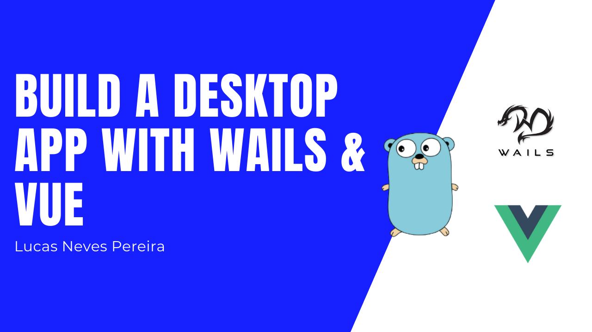

Hi everyone!
In this post I want to show how to quickly setup a desktop app using this amazing Go library [**Wails**](https://github.com/wailsapp/wails).

Basically, Wails allows to write desktop softwares using web technologies like Angular, React, Vue, Svelte..

## Installing Wails

Getting started with this library is quite easy, if you have all the [prerequesites]() you just need to run a _go get_ to install it in your local machine, if you need details this is going to add wails to the **pkg** directory of your **GOPATH**.

Go ahead and run the following command:

```
go get -u github.com/wailsapp/wails/cmd/wails
```

Once you've installed it you can run `wails init` to create a new wails application.

## How Wails work

Normally, the `wails init` command prompt you some questions like the name of your app but also the front end tecnhologie you want to use.

I've named my app `randomapp` and I am choosing _VueJS_ as a frontend framework.


This is going to generate all the files you need to get started.

What I found very cool is the way that _wails_ allows you to connect your backend logic to your frontend.

There is a wails function named `bind` that does all the work for you as you can see in their example when you open `main.go`.


Here `app.bind(basic)` is binding the `basic` function, and we can access it from the frontend.

Let's serve the application so I can show you how, for development the best way to serve this app is by open two terminal windows.

One placed in the root of the project to run the backend with the following command: `wails serve`


And a second one placed in the frontend directory to run the frontend with the following command: `npm run serve`


Now if we visit `http://localhost:8080`, we can see our application


Good! Let's open a console in our browser to fetch that backend data by simply calling `backend.basic()`.


We can see that we have access to our basic function binded from the backend that returns a "Hello, World!" string.

That's basically how things work with Wails. Now let's put all of this in practice and build a random application.

## Build the actual application

### Backend

Starting from the backend I'll get rid of the `basic` bind and function. Also I'll add a resizable option set to true in `wails.CreateApp` config so that our window later can be, well, resizable 🙂.


So, instead of that basic function I'll create a very simple package that I will name `server` with a `server.go` file.


There I'll create a `struct` and a `New` function to return an instance of my `server` struct.


Next, I'll add to that a receiver function of Server that will just return some random data.


Now the last step is to bind this using `app.Bind` in our `main.go` file.


That's all we have to do for the backend data, we have kept it simple.

### Frontend

Let's jump now to our frontend directory that is a VueJs app with some components already in place, we have a Home and an About page.

I want to keep it simple so I'll delete the `components`, `store` and `views` folders. We only need the `App.vue`.

Make sure to remove the unnecessary html tags from `App.vue` and to remove the `use(store)` and `use(router)` from the create app mount function in the `main.js` file.


Okay, next let's add a button to our template with a click event binded to a `fetchData`.


That `fetchData` method will call our backend as we did in the browser console previously. To the that we use `window.backend` and the we have access to our `Server` (because we bind it 💪🏻) and it's `GetRandomData()` function.

The result from `GetRandomData` will be assigned to a template variable and the work is done!


Let's package of our code to test this out as a desktop app.

## Package the final application

The final step is to simply package the application, or build the desktop app ready to use.

For that we can stop the process running in our terminal windows for development and instead run the following command in the root of our project:

```
wails build -p
```


Now if you go to the `build` directory of your project you have a `.app` or `.exe` depends on what operating system you are using.


You just have to open it and test our application!!

_Quick Note: _ I've changed the colour property in `main.go` to have a white background and then run `wails build -p` again 🙂


Seems to work just fine 👍🏼

## Conclusion

That's it for this post, you now have an idea on how you can build your next desktop application using this _Golang_ framework.

Hope this will be helpful 😀

See you soon 👋🏼
