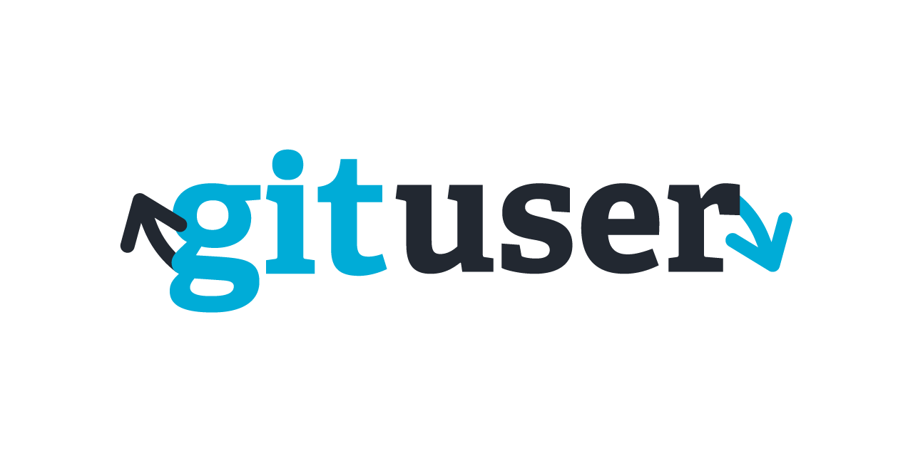

\
Hello there 🙂

First of all you all may be wondering "What in the world is **gituser**??"

**[Gituser](https://github.com/lucasnevespereira/go-gituser)** is a command line interface made with Golang that helps to switch between different git user accounts.

I have built this cli because I was using my laptop for my personal projects, my school projects and my work related projects. Meaning I had multiple git user accounts in my machine.

Every time I had to type the following command:

```
git config --global user.name "myUserName"
git config --global user.email "myEmail"
```

This may not be the need of a lot of developers but I've decided to put this program as open source in case other developers need it. You can find the project [here](https://github.com/lucasnevespereira/go-gituser) as well as the [contribution guide](https://github.com/lucasnevespereira/go-gituser/blob/main/CONTRIBUTING.md) I have wrote.

Being a newbie to golang and open source projects I think that this program as a lot of room for improvement.

## Usage

Gituser can be use globally in your machine, that's the point of cli tools I guess 😀 , therefore there is a few steps that you need to make like exporting variables on your **PATH**, I have also wrote a guide about how to proceed on **MacOS**. You can find it [here](https://github.com/lucasnevespereira/go-gituser/blob/main/MACOS_PATH.md). I know that this can be improved but I just don't have enough experience about building "installers".

Once you have the tool on your machine you can test it out by running `gituser` on a terminal.


This will print you a manual.

## Modes

There are currently 3 modes available in the program:

- 💻 <b>work</b> : for a work related git account.
- 📚 <b>school</b> : for a school related git account.
- 🏠 <b>personal</b> : for a personal related git account.

You can run `gituser -now` to see what mode you are using.

To switch from a mode to another you just have to run `gituser <mode>`.

Examples:

```
gituser work
```

```
gituser school
```

```
gituser personal
```

## Data configuration

The modes are cool but we need to actually add our multiple git accounts data to our program.

To do so you just have to run:

```
gituser config
```

This will prompt you to a select where you can choose what mode account you want to configure.


After choosing your mode you just have to enter your username and email of the related git account.


This will then write your data to a local `data.json` file that you normally exported to your PATH if you followed the [installation guide](https://github.com/lucasnevespereira/go-gituser/blob/main/MACOS_PATH.md) 👍🏼

## Conclusion

That's basically what I have for now! You can use **gituser** and test it out.

Hope this helps developers that have the same need as I. Feel free to leave some remarks, I know there is a quite of them. Once again I am very new to this world 😀.

Find the [project here](https://github.com/lucasnevespereira/go-gituser).

See you soon! 👋🏼
