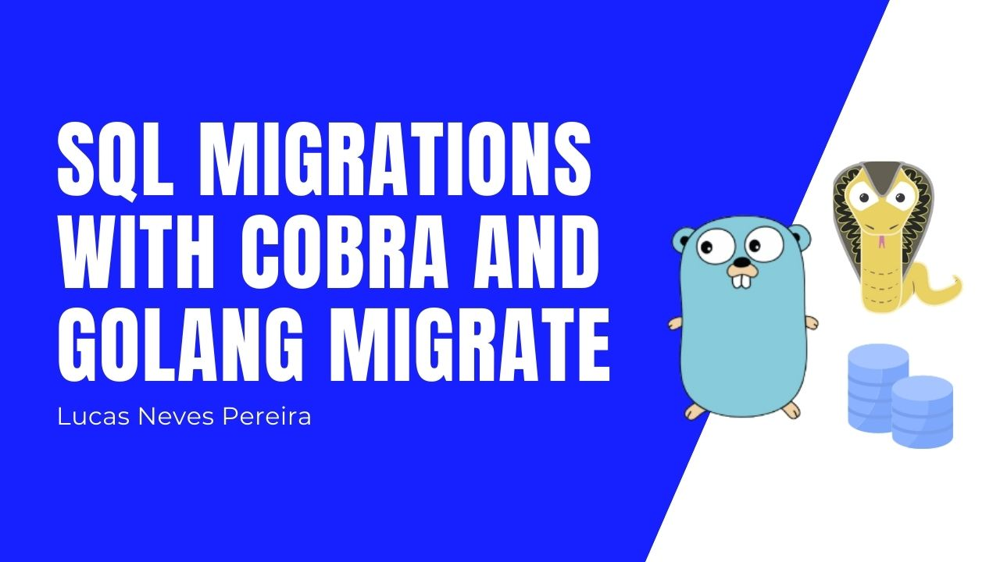

Hello dear readers, lately I've been struggling to run database migrations in Golang with `sqlite3` but I have found a solution and I want to share it with you guys.

## Let's do this

Start by creating a simple project Golang project in your computer

```
mkdir migration-cli
cd migration-cli
go mod init migration-cli
```

Then get the cobra package

```
go get -u github.com/spf13/cobra
```

Open this in your favourite code editor and create and add a `main.go` file


## Adding Cobra

We are going to start by creating a package **cmd** with a `root.go` file.

There we are going to setup a root command for our cli using cobra of course. The name of this cli will be **mcli** for example purposes.


#### SubCommands

Let's create a subcommand named **migrate** that will have a another `up` and `down` subcommand.

`migrate.go` will be a very simple file, it is like a subroot command that is added to the root command 🙂


Now we can create `migrateUp.go` and `migrateDown.go` that are subcommands for **migrate**. The difference is that **up** and **down** will have an extra **Run** cobra property where we are going to write the actual logic to run our migrations.


To finish setting this up, in our `main.go` we need to call **Execute()** from our `cmd/root.go` file.

To test if the commands are called you can either build your program with a custom name and then call it

```
go build -o mcli
./mcli migrate up
```

or for now just use `go run`

```
go run main.go migrate up
```


## Setup Database

I'll be using sqlite3 for the database, I'm gonna start by creating a **database** package with a `config` file.

In that config file I'll write a **Open** method that will return an instance of my database.

For that I'll need the sqlite3 driver package

```
go get -u github.com/mattn/go-sqlite3
```


Now we can call **database.Open()** in our migrate subcommands to test the database connection.


```
go build -o mcli
./mcli migrate up
```


It's working and as you can see it created a **myDB** file.
I will open this file in [DB Browser for Sqlite](https://sqlitebrowser.org/) that is a GUI for SQLITE.


Okay we know how to open our database let's write our migrations.

## Migrations

In a new directory **migrations** I am going to create a `1_install.up.sql` file and a `1_install.down.sql`, this syntax will allow [golang migrate](https://github.com/golang-migrate/migrate) to know the version of our migration file as well as the action.


Now let's add [golang migrate](https://github.com/golang-migrate/migrate)

```
go get -u github.com/golang-migrate/migrate/v4
```

Back to `migrateUp.go` we are going to write the logic to run our up migration using golang migrate package.

Let's build the program and run `./mcli migrate up` again to test this 🙂


Seems to be working, if we open the myDB file in [DB Browser for Sqlite](https://sqlitebrowser.org/) again we should see our tables.


Perfect! Now let's do the same thing for `migrate down` the logic is basically the same but instead of call the golang migrate built in func **Up()** we call **Down()**.


Let's test `migrate down` 👍🏼


Now if you open your `myDB` file again our tables should be gone.


## Conclusion

Okay, that's it! I hope this article will help 😀
The code source is [here](https://github.com/lucasnevespereira/migration-cli).
Youtube video [here](https://www.youtube.com/watch?v=QfXNZMTv-M4).

See you soon 👋🏼
