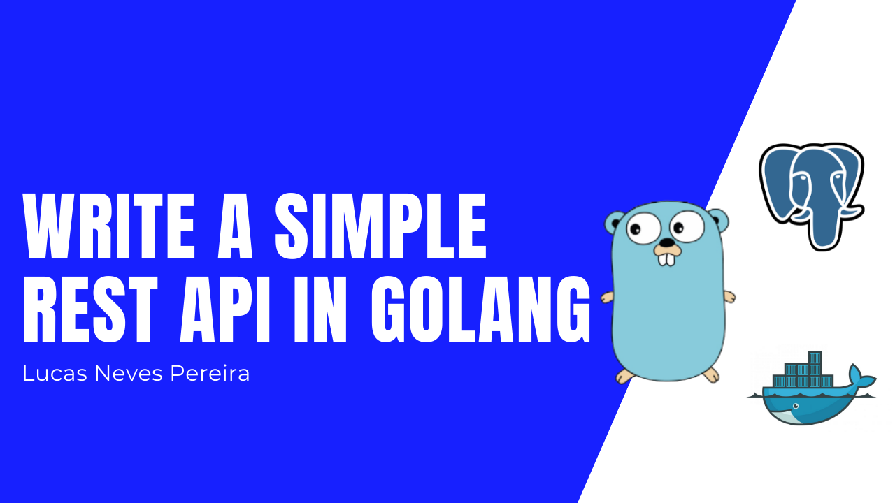

Hello there 😀

In this brief article I will explain how I write a **REST API** using **Golang** trying to follow some best practices.

The source code to follow along if needed is [here](https://github.com/lucasnevespereira/posts-rest-api).

# Let's do this 👍🏻

As an example we'll be creating a very simple Post API.

## Structure the project

Let's jump to our terminal and create a new directory for our project and then init a go module.

```
mkdir postapi
cd postapi
go mod init postapi
```

<b>Note: </b> Best practice for module naming is to use `<domain>/<nameOfApp>`

Now that we have this let's open our project in our favorite code editor and create a `main.go` file with a package main. This will be the entry point of our application.

Next, create a package **app** with a `app.go` file


Inside of it we are going to create an **App struct** that will represent the structure of our app. There will be two fields on this struct, our app is going to have a **DB** and a **Router**.
The router will be a [gorilla/mux](https://github.com/gorilla/mux) router, so let's go ahead and and import it:

```
go get -u github.com/gorilla/mux
```

Let's add it to our struct


Now we are gonna create a <b>New()</b> func that will be in charge of returning the actual application based on our struct.


Now in our `main.go` file we can call this function and create a new app.


Okay, the entry point of the app is structured, let's continue with the routing.

## Routing

Let's use the **Router** of our **App** that we defined before to implement basic routing.
In our `app.go` file we are going to create an **InitRoutes** func that will be called inside of our **New()** func when we create the application. This function will be a receiver of our **App**. Actually a lot of our methods we will be receivers from our app from now. Since our Router fields in our struct **App** is of type [gorilla/mux](https://github.com/gorilla/mux) router we have access to it's methods.


Let's very quickly replace the **nil** with a simple handler for our index route. For that create a `handlers.go` file in our package app. This is where we are going to store the handlers for our routes. I am going to create an **IndexHandler()** handler that will return an **http.HandlerFunc** printing a response "Welcome to Post API".


Now let's call this handler in our route.


Perfect, to test this out, we need to go back to the `main.go` file to serve the app on a port of our choice and the redirect it to our **app Router**. Also I've made a check function to print help with error handling.


Ok, now we can run our app with `go run main.go` and curl the endpoint to see if we get a response.

```
curl http://localhost:9000
```


Cool, routing seems to be working!

## Database

It is time to setup our database, I have chosen to go with **PostgreSQL**, to avoid local setup I'll be running my database on a **Docker** container.

I'll be using the following command:

```
docker run --name postapidb --env POSTGRES_PASSWORD=postgres -p 5432:5432 -d postgres
```

<b>Note: </b> To stop you just need to run `docker stop postapidb` and to remove it `docker rm postapidb`

Okay, now we have a database running let's jump to the code and create a new package **database** inside of our **app** package.

Let's create a `db.go` file and inside we are going to have an interface. I am going to call it `PostDB`, this interface it's like a contract (methods to implement) that we have to respect if we want our database to be a **PostDB** database. Let's start by saying that a **PostDB** should implement a **Open()** and a **Close** method that can return an error.

We are also going to have a **DB** structure like for our app that will have a single field db of type [sqlx DB](https://github.com/jmoiron/sqlx) that is like a superset of **database/sql** from the Go standard library. Let's run a go get for **sqlx** and **lib/pq** (postgres sql driver) and then implement this.

```
go get -u github.com/jmoiron/sqlx
```

```
go get -u github.com/lib/pq
```


Now before writing the body of our **Open()** and **Close()** we can add a database fields to our App struct in `app.go` saying we are using a **PostDB** in this app 🙂


Moving on, starting with our **Open** method let's open a new connection to our postgres database.


To establish this connection, the second argument of the **sqlx.Open()** method is a postgres connection string. Let's build this string in a seperate file called `config.go` still in the **database** package.


Another thing I want to do is create a SQL schema that will be run after the connection. This schema will just create a table posts in our db in case there is not one. Let's add this to a `schemas.go` file.


Our **Close** method will be a lot simpler. We just need call the method Close from **sqlx**


Before writing some methods for our data, let's jump to the `main.go` file and init the connection to the database.


Let's run `go run main.go`


The database is configured but is not quite finished because I want to implement some methods (like CreatePost and GetPosts) but for that we first need a **Post** Model.

## Models

Go ahead and create a new package **models** inside of the **app** package and create a `post.go` file. Inside of it we are going to have a **Post** struct with 4 fields.


Since this is a REST API we are later going to be mapping our responses to JSON and sometimes the fields from our database might not correspond to our json fields or maybe we want to have flexibility to add new fields or remove fields.
For that, let's already create a **JsonPost** struct to our file.


Last thing I want to add to this file is going to be useful in a few seconds. When we add a post to our database the ID is auto incremented, meaning we do not have to pass the ID when making a request to create a new post. So let's create a **PostRequest** struct for that.


Back to our database in our `db.go` file I want to add 2 methods to my **PostDB** interface, **GetPosts** and **CreatePost**.

<b>Note: </b> I'll not be implementing all the REST verbs endpoints (trying to keep it short) just a simple GET and POST.


In our `schemas.go` file I want to add a simple **insertPostSchema** for my **CreatePost** method.


Let's create a `methods.go` file and write our methods.


## Http Handlers

Now that we have all of our methods to interact with our database, let's write our http handlers as we did before for the **IndexHandler**. In our `handlers.go` file let's start with the **CreatePostHandler**.

What we are going to do is initialize an empty **PostRequest** struct, the parse the request body that the user entered to that struct. To parse or map the request body I am going to write a helper func named simply **parse** that I will put in a `helpers.go` file.


Once again, this is a **REST API** so it is good practice to send a http status. We are going to send a lot of responses with an http status, so I will write another helper func for this in the `helpers.go` file that sends a JSON response with a status.


By the way, remember we had a **JsonPost** struct in case we want that flexibility? Let's add a last helper function (`helpers.go`) just to map data to that struct.


Continuing with the **CreatePostHandler**, now that we have parsed the request body we need to use that data to create a new post and save it in our database.


Now to finish the **CreatePostHandler** we just have to create a new route in our func **initRoutes** from our `app.go` file and call our handler.


Run `go run main.go` again and let's test this on [Insomnia](https://insomnia.rest/download).


Seems to be working 👍🏻

Before moving on to tests let's implement **GetPostHandler** that should be simpler.


Relaunch the app


Test with insomnia


Perfect, this is working 🙂

## Tests

It is also very good practice to test our code, that's why we need to try to add test coverage to our app. For that you can create a **test** package and add a test file for what you want to test, for example `handler_test.go` or `db_test.go`.


I have actually made a [video](https://youtu.be/DaZDqRBIKCA) and wrote an [article](https://dev.to/lucasnevespereira/implementing-testing-in-golang-4mcp) about implementing tests in Golang so you can can check those out 🙂

## Conclusion

That's it! I am going to stop this article here, I know there is room for improvement but I wanted to keep this short and just talk about the foundation.

As always don't hesitate to give me feedback, the role of a developer today is to keep improving and that's what I want to do 🙂

Don't hesitate to check my _[Youtube Channel](https://www.youtube.com/channel/UC7JqfPrr4nHKvbwLAdk-MgA)_, you can also contact me on my [twitter account](https://twitter.com/lucaasnp_) and of course I will link the [github repository](https://github.com/lucasnevespereira/posts-rest-api) for this article.

See you soon! 👋🏻
